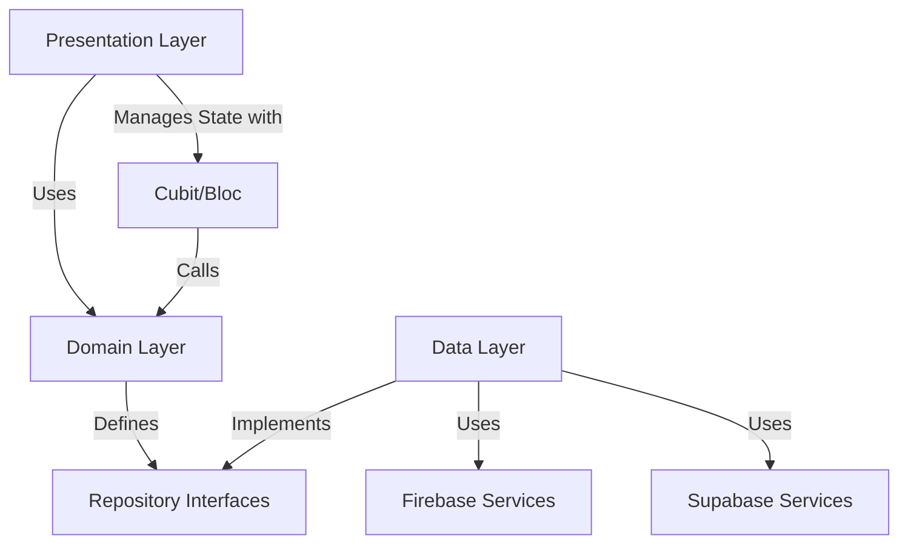
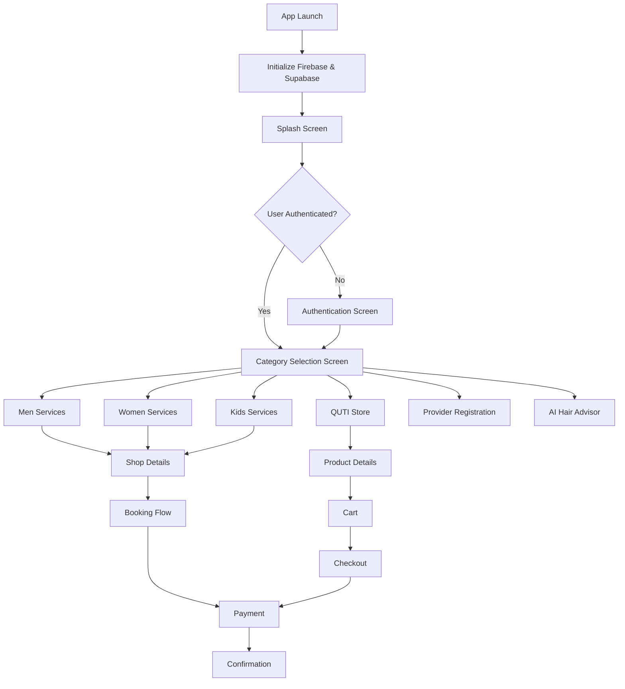
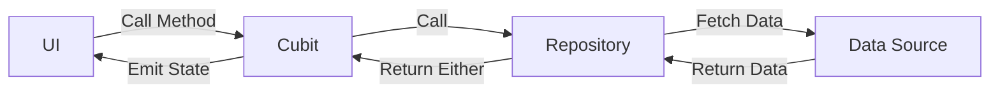
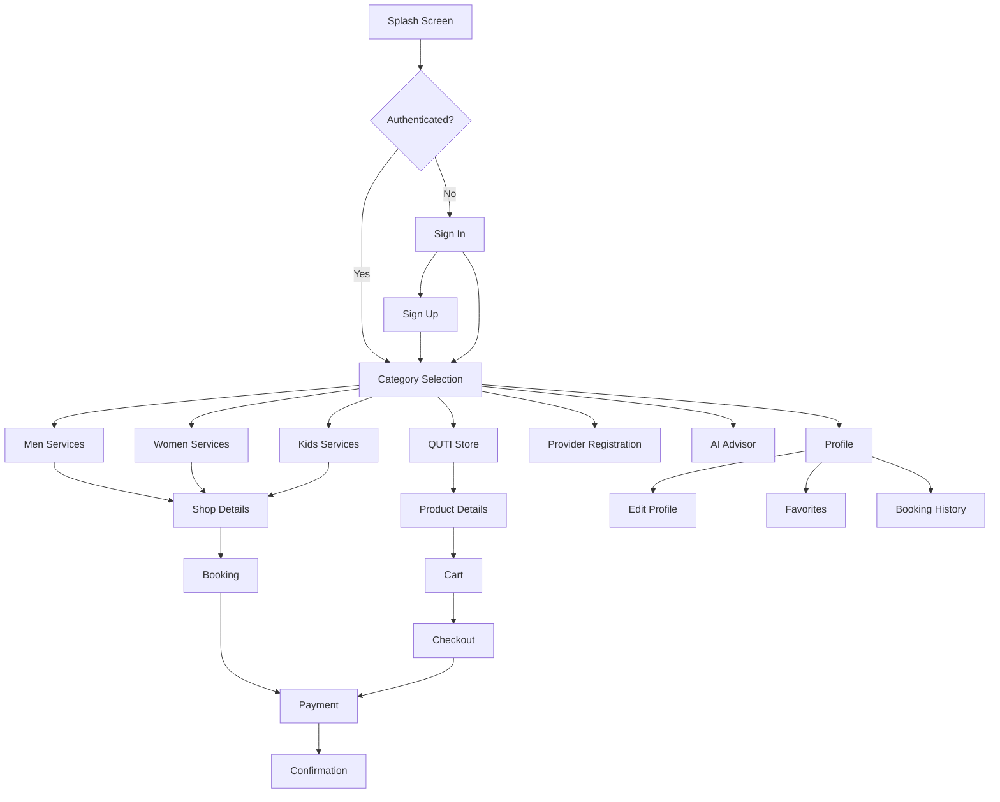

# Design Document - Barber Booking App

## Overview

تطبيق Barber Booking App هو منصة متكاملة تربط بين العملاء ومقدمي خدمات الحلاقة والتجميل. التطبيق مبني باستخدام Flutter مع Clean Architecture والنمط Feature-First، ويدمج Firebase للمصادقة والبيانات الفورية، وSupabase لتخزين الملفات والبيانات الإضافية.

### Core Objectives

- توفير تجربة مستخدم سلسة لحجز مواعيد الحلاقة والتجميل
- تنظيم الخدمات حسب الفئات (رجال، نساء، أطفال)
- توفير متجر لمنتجات العناية الشخصية
- تمكين مقدمي الخدمة من الانضمام للمنصة
- استخدام الذكاء الاصطناعي لتقديم استشارات التسريحات
- ضمان قابلية الصيانة والتوسع من خلال معماري نظيفة

### Technology Stack

- **Frontend**: Flutter 3.x with Dart
- **State Management**: Cubit/Bloc pattern
- **Dependency Injection**: GetIt
- **Backend Services**: Firebase (Auth, Firestore, Cloud Messaging, Storage), Supabase (Storage, Database)
- **Architecture**: Clean Architecture with Feature-First structure
- **Navigation**: Named routes with Navigator 2.0
- **Localization**: easy_localization package
- **Image Handling**: cached_network_image
- **Error Handling**: dartz package (Either type)

## Architecture

### Clean Architecture Layers


التطبيق يتبع Clean Architecture مع ثلاث طبقات رئيسية:

#### 1. Presentation Layer (UI)
- **Views/Screens**: الشاشات المرئية للمستخدم
- **Widgets**: المكونات القابلة لإعادة الاستخدام
- **Cubits**: إدارة الحالة باستخدام Cubit/Bloc
- **Models**: نماذج العرض (View Models)

#### 2. Domain Layer (Business Logic)
- **Entities**: الكيانات الأساسية للتطبيق
- **Repository Interfaces**: تعريفات المستودعات
- **Use Cases**: حالات الاستخدام (اختياري للمشاريع الصغيرة)

#### 3. Data Layer
- **Repository Implementations**: تنفيذ المستودعات
- **Data Sources**: مصادر البيانات (Remote/Local)
- **Models**: نماذج البيانات مع fromJson/toJson

### Feature-First Directory Structure

```
lib/
├── main.dart
├── core/
│   ├── entities/              # Shared entities across features
│   │   ├── user_entity.dart
│   │   ├── booking_entity.dart
│   │   ├── service_entity.dart
│   │   └── shop_entity.dart
│   ├── models/                # Shared data models
│   │   ├── user_model.dart
│   │   ├── booking_model.dart
│   │   └── service_model.dart
│   ├── repos/                 # Shared repository interfaces
│   │   ├── user_repo.dart
│   │   └── booking_repo.dart
│   ├── services/              # Core services
│   │   ├── firebase_auth_service.dart
│   │   ├── firestore_service.dart
│   │   ├── supabase_storage_service.dart
│   │   ├── get_it_service.dart        # Dependency injection setup
│   │   ├── navigation_service.dart
│   │   ├── fcm_service.dart           # Firebase Cloud Messaging
│   │   ├── notification_service.dart
│   │   ├── location_service.dart
│   │   └── payment_service.dart
│   ├── utils/                 # Utilities and helpers
│   │   ├── color_manager.dart
│   │   ├── text_styles.dart
│   │   ├── constants.dart
│   │   ├── validators.dart
│   │   ├── date_formatter.dart
│   │   └── image_compressor.dart
│   ├── widgets/               # Shared widgets
│   │   ├── custom_button.dart
│   │   ├── custom_text_field.dart
│   │   ├── loading_widget.dart
│   │   ├── error_widget.dart
│   │   ├── shimmer_loading.dart
│   │   ├── cached_image_widget.dart
│   │   └── rating_widget.dart
│   └── errors/                # Error handling
│       ├── failures.dart
│       └── exceptions.dart
├── features/
│   ├── splash/
│   │   └── presentation/
│   │       ├── views/
│   │       │   └── splash_view.dart
│   │       └── cubit/
│   │           ├── splash_cubit.dart
│   │           └── splash_state.dart
│   ├── category_selection/
│   │   └── presentation/
│   │       └── views/
│   │           └── category_selection_view.dart
│   ├── auth/
│   │   ├── data/
│   │   │   ├── models/
│   │   │   │   └── auth_user_model.dart
│   │   │   └── repos/
│   │   │       └── auth_repo_impl.dart
│   │   ├── domain/
│   │   │   └── repos/
│   │   │       └── auth_repo.dart
│   │   └── presentation/
│   │       ├── views/
│   │       │   ├── sign_in_view.dart
│   │       │   ├── sign_up_view.dart
│   │       │   └── phone_verification_view.dart
│   │       └── cubit/
│   │           ├── auth_cubit.dart
│   │           └── auth_state.dart
│   ├── men_services/
│   │   ├── data/
│   │   │   ├── models/
│   │   │   │   └── barbershop_model.dart
│   │   │   └── repos/
│   │   │       └── barbershop_repo_impl.dart
│   │   ├── domain/
│   │   │   ├── entities/
│   │   │   │   └── barbershop_entity.dart
│   │   │   └── repos/
│   │   │       └── barbershop_repo.dart
│   │   └── presentation/
│   │       ├── views/
│   │       │   ├── men_services_view.dart
│   │       │   └── barbershop_details_view.dart
│   │       ├── widgets/
│   │       │   └── barbershop_card.dart
│   │       └── cubit/
│   │           ├── barbershop_cubit.dart
│   │           └── barbershop_state.dart
│   ├── women_services/         # Similar structure to men_services
│   ├── kids_services/          # Similar structure to men_services
│   ├── store/
│   │   ├── data/
│   │   │   ├── models/
│   │   │   │   └── product_model.dart
│   │   │   └── repos/
│   │   │       └── product_repo_impl.dart
│   │   ├── domain/
│   │   │   ├── entities/
│   │   │   │   └── product_entity.dart
│   │   │   └── repos/
│   │   │       └── product_repo.dart
│   │   └── presentation/
│   │       ├── views/
│   │       │   ├── store_view.dart
│   │       │   └── product_details_view.dart
│   │       ├── widgets/
│   │       │   └── product_card.dart
│   │       └── cubit/
│   │           ├── product_cubit.dart
│   │           └── product_state.dart
│   ├── cart/
│   │   ├── data/
│   │   │   ├── models/
│   │   │   │   └── cart_item_model.dart
│   │   │   └── repos/
│   │   │       └── cart_repo_impl.dart
│   │   ├── domain/
│   │   │   ├── entities/
│   │   │   │   └── cart_item_entity.dart
│   │   │   └── repos/
│   │   │       └── cart_repo.dart
│   │   └── presentation/
│   │       ├── views/
│   │       │   └── cart_view.dart
│   │       └── cubit/
│   │           ├── cart_cubit.dart
│   │           └── cart_state.dart
│   ├── booking/
│   │   ├── data/
│   │   │   ├── models/
│   │   │   │   └── booking_model.dart
│   │   │   └── repos/
│   │   │       └── booking_repo_impl.dart
│   │   ├── domain/
│   │   │   └── repos/
│   │   │       └── booking_repo.dart
│   │   └── presentation/
│   │       ├── views/
│   │       │   ├── booking_view.dart
│   │       │   └── booking_history_view.dart
│   │       └── cubit/
│   │           ├── booking_cubit.dart
│   │           └── booking_state.dart
│   ├── provider_registration/
│   │   └── presentation/
│   │       ├── views/
│   │       │   └── provider_registration_view.dart
│   │       └── cubit/
│   │           ├── provider_registration_cubit.dart
│   │           └── provider_registration_state.dart
│   ├── ai_advisor/
│   │   ├── data/
│   │   │   ├── models/
│   │   │   │   └── hairstyle_suggestion_model.dart
│   │   │   └── repos/
│   │   │       └── ai_advisor_repo_impl.dart
│   │   ├── domain/
│   │   │   ├── entities/
│   │   │   │   └── hairstyle_suggestion_entity.dart
│   │   │   └── repos/
│   │   │       └── ai_advisor_repo.dart
│   │   └── presentation/
│   │       ├── views/
│   │       │   └── ai_advisor_view.dart
│   │       └── cubit/
│   │           ├── ai_advisor_cubit.dart
│   │           └── ai_advisor_state.dart
│   ├── profile/
│   │   └── presentation/
│   │       ├── views/
│   │       │   ├── profile_view.dart
│   │       │   └── edit_profile_view.dart
│   │       └── cubit/
│   │           ├── profile_cubit.dart
│   │           └── profile_state.dart
│   ├── favorites/
│   │   └── presentation/
│   │       ├── views/
│   │       │   └── favorites_view.dart
│   │       └── cubit/
│   │           ├── favorites_cubit.dart
│   │           └── favorites_state.dart
│   └── search/
│       └── presentation/
│           ├── views/
│           │   └── search_view.dart
│           └── cubit/
│               ├── search_cubit.dart
│               └── search_state.dart
└── config/
    ├── routes/
    │   └── app_router.dart
    └── themes/
        └── app_theme.dart
```

### Architecture Flow




### Dependency Flow Rules

- **Presentation** → **Domain** → **Data**
- Dependencies always flow inward (Presentation depends on Domain, Data implements Domain)
- Domain layer is independent (no dependencies on outer layers)
- Data layer depends only on Domain interfaces

## Components and Interfaces

### Core Services

#### 1. Firebase Auth Service

```dart
class FirebaseAuthService {
  final FirebaseAuth _auth = FirebaseAuth.instance;
  
  // Sign in with email and password
  Future<Either<Failure, User>> signInWithEmail(String email, String password);
  
  // Sign in with phone number
  Future<Either<Failure, String>> signInWithPhone(String phoneNumber);
  
  // Verify OTP code
  Future<Either<Failure, User>> verifyOTP(String verificationId, String code);
  
  // Sign in with Google
  Future<Either<Failure, User>> signInWithGoogle();
  
  // Sign out
  Future<void> signOut();
  
  // Get current user
  User? getCurrentUser();
  
  // Stream of auth state changes
  Stream<User?> authStateChanges();
}
```

#### 2. Firestore Service

```dart
class FirestoreService {
  final FirebaseFirestore _firestore = FirebaseFirestore.instance;
  
  // Generic CRUD operations
  Future<Either<Failure, void>> addDocument(String collection, Map<String, dynamic> data);
  Future<Either<Failure, Map<String, dynamic>>> getDocument(String collection, String docId);
  Future<Either<Failure, List<Map<String, dynamic>>>> getDocuments(String collection, {Query? query});
  Future<Either<Failure, void>> updateDocument(String collection, String docId, Map<String, dynamic> data);
  Future<Either<Failure, void>> deleteDocument(String collection, String docId);
  
  // Real-time stream
  Stream<QuerySnapshot> streamCollection(String collection, {Query? query});
}
```


#### 3. Supabase Storage Service

```dart
class SupabaseStorageService {
  static final _instance = SupabaseStorageService._internal();
  factory SupabaseStorageService() => _instance;
  SupabaseStorageService._internal();
  
  late final SupabaseClient _client;
  
  // Initialize Supabase
  static Future<void> initSupabase() async {
    await Supabase.initialize(
      url: 'YOUR_SUPABASE_URL',
      anonKey: 'YOUR_SUPABASE_ANON_KEY',
    );
  }
  
  // Upload image
  Future<Either<Failure, String>> uploadImage(File file, String bucket, String path);
  
  // Delete image
  Future<Either<Failure, void>> deleteImage(String bucket, String path);
  
  // Get public URL
  String getPublicUrl(String bucket, String path);
}
```

#### 4. GetIt Service (Dependency Injection)

```dart
final getIt = GetIt.instance;

void setupGetIt() {
  // Register Navigator Key
  getIt.registerSingleton<GlobalKey<NavigatorState>>(GlobalKey<NavigatorState>());
  
  // Register Core Services
  getIt.registerSingleton<FirebaseAuthService>(FirebaseAuthService());
  getIt.registerSingleton<FirestoreService>(FirestoreService());
  getIt.registerLazySingleton<SupabaseStorageService>(() => SupabaseStorageService());
  getIt.registerSingleton<NavigationService>(NavigationService());
  getIt.registerSingleton<FCMService>(FCMService());
  getIt.registerSingleton<NotificationService>(NotificationService());
  getIt.registerSingleton<LocationService>(LocationService());
  
  // Register Repositories
  getIt.registerSingleton<AuthRepo>(AuthRepoImpl(
    firebaseAuthService: getIt<FirebaseAuthService>(),
    firestoreService: getIt<FirestoreService>(),
  ));
  
  getIt.registerSingleton<BookingRepo>(BookingRepoImpl(
    firestoreService: getIt<FirestoreService>(),
  ));
  
  // Register Cubits as Factories (new instance each time)
  getIt.registerFactory<AuthCubit>(() => AuthCubit(getIt<AuthRepo>()));
  getIt.registerFactory<BookingCubit>(() => BookingCubit(getIt<BookingRepo>()));
  // ... other cubits
}
```


#### 5. Navigation Service

```dart
class NavigationService {
  final GlobalKey<NavigatorState> navigatorKey = getIt<GlobalKey<NavigatorState>>();
  
  Future<dynamic> navigateTo(String routeName, {Object? arguments}) {
    return navigatorKey.currentState!.pushNamed(routeName, arguments: arguments);
  }
  
  Future<dynamic> navigateAndReplace(String routeName, {Object? arguments}) {
    return navigatorKey.currentState!.pushReplacementNamed(routeName, arguments: arguments);
  }
  
  Future<dynamic> navigateAndRemoveUntil(String routeName, {Object? arguments}) {
    return navigatorKey.currentState!.pushNamedAndRemoveUntil(
      routeName, 
      (route) => false,
      arguments: arguments,
    );
  }
  
  void goBack() {
    navigatorKey.currentState!.pop();
  }
}
```

#### 6. FCM Service (Firebase Cloud Messaging)

```dart
class FCMService {
  final FirebaseMessaging _messaging = FirebaseMessaging.instance;
  
  // Initialize FCM
  Future<void> init() async {
    // Request permission
    await _requestPermission();
    
    // Get FCM token
    String? token = await _messaging.getToken();
    
    // Handle foreground messages
    FirebaseMessaging.onMessage.listen(_handleForegroundMessage);
    
    // Handle background messages
    FirebaseMessaging.onBackgroundMessage(_firebaseMessagingBackgroundHandler);
    
    // Handle notification tap
    FirebaseMessaging.onMessageOpenedApp.listen(_handleNotificationTap);
  }
  
  Future<void> _requestPermission() async {
    NotificationSettings settings = await _messaging.requestPermission(
      alert: true,
      badge: true,
      sound: true,
    );
  }
  
  void _handleForegroundMessage(RemoteMessage message) {
    // Show local notification
  }
  
  void _handleNotificationTap(RemoteMessage message) {
    // Navigate to relevant screen
  }
}
```


### Repository Pattern

كل feature يحتوي على Repository Interface في domain layer وImplementation في data layer.

#### Example: Booking Repository

**Domain Layer (Interface)**
```dart
// lib/core/repos/booking_repo.dart
abstract class BookingRepo {
  Future<Either<Failure, List<BookingEntity>>> getBookings(String userId);
  Future<Either<Failure, BookingEntity>> getBookingById(String bookingId);
  Future<Either<Failure, void>> createBooking(BookingEntity booking);
  Future<Either<Failure, void>> cancelBooking(String bookingId);
  Future<Either<Failure, List<TimeSlot>>> getAvailableTimeSlots(String shopId, DateTime date);
}
```

**Data Layer (Implementation)**
```dart
// lib/features/booking/data/repos/booking_repo_impl.dart
class BookingRepoImpl implements BookingRepo {
  final FirestoreService firestoreService;
  
  BookingRepoImpl({required this.firestoreService});
  
  @override
  Future<Either<Failure, List<BookingEntity>>> getBookings(String userId) async {
    try {
      final docs = await firestoreService.getDocuments(
        'bookings',
        query: FirebaseFirestore.instance
            .collection('bookings')
            .where('userId', isEqualTo: userId),
      );
      
      return docs.fold(
        (failure) => Left(failure),
        (data) {
          final bookings = data.map((doc) => BookingModel.fromJson(doc).toEntity()).toList();
          return Right(bookings);
        },
      );
    } catch (e) {
      return Left(ServerFailure(message: e.toString()));
    }
  }
  
  // ... other implementations
}
```


## High-Level Design

### Application Flow



### Main App Structure (main.dart)

```dart
void main() async {
  WidgetsFlutterBinding.ensureInitialized();
  
  // Initialize Firebase
  await Firebase.initializeApp(
    options: DefaultFirebaseOptions.currentPlatform,
  );
  
  // Initialize Supabase
  await SupabaseStorageService.initSupabase();
  
  // Setup Dependency Injection
  setupGetIt();
  
  // Initialize localization
  await EasyLocalization.ensureInitialized();
  
  // Run app
  runApp(
    EasyLocalization(
      supportedLocales: const [Locale('ar'), Locale('en')],
      path: 'assets/translations',
      fallbackLocale: const Locale('ar'),
      child: const BarberBookingApp(),
    ),
  );
}
```


```dart
class BarberBookingApp extends StatelessWidget {
  const BarberBookingApp({super.key});

  @override
  Widget build(BuildContext context) {
    return ScreenUtilInit(
      designSize: const Size(393, 852),
      minTextAdapt: true,
      splitScreenMode: true,
      builder: (context, child) {
        return MaterialApp(
          debugShowCheckedModeBanner: false,
          title: 'Barber Booking',
          theme: AppTheme.lightTheme,
          localizationsDelegates: context.localizationDelegates,
          supportedLocales: context.supportedLocales,
          locale: context.locale,
          navigatorKey: getIt<GlobalKey<NavigatorState>>(),
          onGenerateRoute: AppRouter.onGenerateRoute,
          initialRoute: SplashView.routeName,
        );
      },
    );
  }
}
```

## Low-Level Design

### 1. Splash Screen

#### Purpose
شاشة البداية التي تظهر عند فتح التطبيق، تعرض اللوجو وتقوم بتهيئة الخدمات الأساسية.

#### Components

**SplashView**
```dart
class SplashView extends StatefulWidget {
  static const String routeName = '/splash';
  
  const SplashView({super.key});

  @override
  State<SplashView> createState() => _SplashViewState();
}

class _SplashViewState extends State<SplashView> {
  @override
  void initState() {
    super.initState();
    _initialize();
  }
  
  Future<void> _initialize() async {
    // Minimum display time: 2 seconds
    final minDisplayTime = Future.delayed(const Duration(seconds: 2));
    
    // Initialize app services
    final initializationFuture = _initializeServices();
    
    // Wait for both to complete
    await Future.wait([minDisplayTime, initializationFuture]);
    
    // Navigate to category selection
    if (mounted) {
      Navigator.pushReplacementNamed(context, CategorySelectionView.routeName);
    }
  }
  
  Future<void> _initializeServices() async {
    // Services are already initialized in main.dart
    // This can be used for additional checks
    await Future.delayed(const Duration(milliseconds: 500));
  }

  @override
  Widget build(BuildContext context) {
    return Scaffold(
      backgroundColor: ColorManager.primary,
      body: Center(
        child: Column(
          mainAxisAlignment: MainAxisAlignment.center,
          children: [
            // App Logo
            Image.asset(
              'assets/images/logo.png',
              width: 200,
              height: 200,
            ),
            const SizedBox(height: 24),
            // Loading Indicator
            const CircularProgressIndicator(
              color: Colors.white,
            ),
          ],
        ),
      ),
    );
  }
}
```

#### Design Decisions
- **لا يوجد Cubit**: الشاشة بسيطة ولا تحتاج إلى state management معقد
- **Timer-based**: استخدام Timer لضمان عرض الشاشة لمدة لا تقل عن 2 ثانية
- **Error Handling**: في حالة فشل التهيئة، يتم عرض رسالة خطأ مع خيار إعادة المحاولة

### 2. Category Selection Screen

#### Purpose
الشاشة الرئيسية التي تعرض ستة خيارات للفئات المختلفة للتطبيق.

#### UI Layout

```
┌─────────────────────────────────────┐
│         App Bar (Logo/Title)        │
├─────────────────────────────────────┤
│                                     │
│   ┌─────────────────────────────┐  │
│   │  Men - Barbershops          │  │
│   │  🧔 Grooming Services       │  │
│   └─────────────────────────────┘  │
│                                     │
│   ┌─────────────────────────────┐  │
│   │  Women - Salons & Beauty    │  │
│   │  💇 Beauty Services         │  │
│   └─────────────────────────────┘  │
│                                     │
│   ┌─────────────────────────────┐  │
│   │  Kids - Fun & Friendly      │  │
│   │  👶 Kid-Friendly Cuts       │  │
│   └─────────────────────────────┘  │
│                                     │
│   ┌─────────────────────────────┐  │
│   │  QUTI Store                 │  │
│   │  🛍️ Shop Products           │  │
│   └─────────────────────────────┘  │
│                                     │
│   ┌─────────────────────────────┐  │
│   │  Join as Provider           │  │
│   │  ✂️ Barbers & Owners        │  │
│   └─────────────────────────────┘  │
│                                     │
│   ┌─────────────────────────────┐  │
│   │  AI Hair Advisor            │  │
│   │  ⭐ Find Your Style         │  │
│   └─────────────────────────────┘  │
│                                     │
└─────────────────────────────────────┘
```


#### Components

**CategorySelectionView**
```dart
class CategorySelectionView extends StatelessWidget {
  static const String routeName = '/category-selection';
  
  const CategorySelectionView({super.key});

  @override
  Widget build(BuildContext context) {
    return Scaffold(
      appBar: AppBar(
        title: Text('barber_booking'.tr()),
        centerTitle: true,
        actions: [
          IconButton(
            icon: const Icon(Icons.person),
            onPressed: () {
              Navigator.pushNamed(context, ProfileView.routeName);
            },
          ),
        ],
      ),
      body: Padding(
        padding: const EdgeInsets.all(16.0),
        child: ListView(
          children: [
            CategoryCard(
              title: 'men_services'.tr(),
              subtitle: 'barbershops_grooming'.tr(),
              icon: Icons.face,
              onTap: () {
                Navigator.pushNamed(context, MenServicesView.routeName);
              },
            ),
            const SizedBox(height: 16),
            CategoryCard(
              title: 'women_services'.tr(),
              subtitle: 'salons_beauty'.tr(),
              icon: Icons.face_3,
              onTap: () {
                Navigator.pushNamed(context, WomenServicesView.routeName);
              },
            ),
            const SizedBox(height: 16),
            CategoryCard(
              title: 'kids_services'.tr(),
              subtitle: 'fun_friendly_cuts'.tr(),
              icon: Icons.child_care,
              onTap: () {
                Navigator.pushNamed(context, KidsServicesView.routeName);
              },
            ),
            const SizedBox(height: 16),
            CategoryCard(
              title: 'quti_store'.tr(),
              subtitle: 'shop_products'.tr(),
              icon: Icons.shopping_bag,
              onTap: () {
                Navigator.pushNamed(context, StoreView.routeName);
              },
            ),
            const SizedBox(height: 16),
            CategoryCard(
              title: 'join_provider'.tr(),
              subtitle: 'barbers_owners'.tr(),
              icon: Icons.content_cut,
              onTap: () {
                Navigator.pushNamed(context, ProviderRegistrationView.routeName);
              },
            ),
            const SizedBox(height: 16),
            CategoryCard(
              title: 'ai_advisor'.tr(),
              subtitle: 'find_style'.tr(),
              icon: Icons.auto_awesome,
              onTap: () {
                Navigator.pushNamed(context, AIAdvisorView.routeName);
              },
            ),
          ],
        ),
      ),
    );
  }
}
```


**CategoryCard Widget**
```dart
class CategoryCard extends StatelessWidget {
  final String title;
  final String subtitle;
  final IconData icon;
  final VoidCallback onTap;

  const CategoryCard({
    super.key,
    required this.title,
    required this.subtitle,
    required this.icon,
    required this.onTap,
  });

  @override
  Widget build(BuildContext context) {
    return Card(
      elevation: 2,
      shape: RoundedRectangleBorder(
        borderRadius: BorderRadius.circular(16),
      ),
      child: InkWell(
        onTap: onTap,
        borderRadius: BorderRadius.circular(16),
        child: Padding(
          padding: const EdgeInsets.all(16.0),
          child: Row(
            children: [
              // Icon
              Container(
                width: 48,
                height: 48,
                decoration: BoxDecoration(
                  color: ColorManager.primary.withOpacity(0.1),
                  borderRadius: BorderRadius.circular(12),
                ),
                child: Icon(
                  icon,
                  size: 32,
                  color: ColorManager.primary,
                ),
              ),
              const SizedBox(width: 16),
              // Text
              Expanded(
                child: Column(
                  crossAxisAlignment: CrossAxisAlignment.start,
                  children: [
                    Text(
                      title,
                      style: TextStyles.bold16,
                    ),
                    const SizedBox(height: 4),
                    Text(
                      subtitle,
                      style: TextStyles.regular14.copyWith(
                        color: ColorManager.grey,
                      ),
                    ),
                  ],
                ),
              ),
              // Arrow
              Icon(
                Icons.arrow_forward_ios,
                size: 16,
                color: ColorManager.grey,
              ),
            ],
          ),
        ),
      ),
    );
  }
}
```

#### Design Decisions
- **لا يوجد Cubit**: الشاشة stateless ولا تحتاج إلى state management
- **Card-based Layout**: استخدام Cards لكل فئة لتوفير visual hierarchy واضح
- **Consistent Icon Size**: جميع الأيقونات بحجم 48x48 pixels
- **Responsive**: استخدام ListView للتمرير في حالة الشاشات الصغيرة


## Data Models

### Core Entities

#### 1. User Entity

```dart
class UserEntity {
  final String id;
  final String name;
  final String email;
  final String? phoneNumber;
  final String? photoUrl;
  final DateTime createdAt;
  final DateTime updatedAt;

  UserEntity({
    required this.id,
    required this.name,
    required this.email,
    this.phoneNumber,
    this.photoUrl,
    required this.createdAt,
    required this.updatedAt,
  });
}
```

#### 2. Shop Entity

```dart
class ShopEntity {
  final String id;
  final String name;
  final String description;
  final String address;
  final double latitude;
  final double longitude;
  final List<String> photoUrls;
  final double rating;
  final int totalReviews;
  final String phoneNumber;
  final Map<String, String> workingHours; // day -> "09:00-21:00"
  final List<String> amenities;
  final ServiceCategory category; // men, women, kids
  final bool isKidFriendly;
  final String ownerId;
  final DateTime createdAt;

  ShopEntity({
    required this.id,
    required this.name,
    required this.description,
    required this.address,
    required this.latitude,
    required this.longitude,
    required this.photoUrls,
    required this.rating,
    required this.totalReviews,
    required this.phoneNumber,
    required this.workingHours,
    required this.amenities,
    required this.category,
    this.isKidFriendly = false,
    required this.ownerId,
    required this.createdAt,
  });
}

enum ServiceCategory { men, women, kids }
```


#### 3. Service Entity

```dart
class ServiceEntity {
  final String id;
  final String shopId;
  final String name;
  final String description;
  final double price;
  final int durationMinutes;
  final String? imageUrl;

  ServiceEntity({
    required this.id,
    required this.shopId,
    required this.name,
    required this.description,
    required this.price,
    required this.durationMinutes,
    this.imageUrl,
  });
}
```

#### 4. Booking Entity

```dart
class BookingEntity {
  final String id;
  final String userId;
  final String shopId;
  final String serviceId;
  final DateTime dateTime;
  final BookingStatus status;
  final double totalPrice;
  final String? notes;
  final DateTime createdAt;
  final DateTime? cancelledAt;

  BookingEntity({
    required this.id,
    required this.userId,
    required this.shopId,
    required this.serviceId,
    required this.dateTime,
    required this.status,
    required this.totalPrice,
    this.notes,
    required this.createdAt,
    this.cancelledAt,
  });
}

enum BookingStatus {
  pending,
  confirmed,
  completed,
  cancelled,
}
```

#### 5. Product Entity

```dart
class ProductEntity {
  final String id;
  final String name;
  final String description;
  final double price;
  final String imageUrl;
  final String category;
  final double rating;
  final int totalReviews;
  final int stockQuantity;
  final String brand;

  ProductEntity({
    required this.id,
    required this.name,
    required this.description,
    required this.price,
    required this.imageUrl,
    required this.category,
    required this.rating,
    required this.totalReviews,
    required this.stockQuantity,
    required this.brand,
  });
}
```


#### 6. Cart Item Entity

```dart
class CartItemEntity {
  final String productId;
  final String productName;
  final double price;
  final String imageUrl;
  final int quantity;

  CartItemEntity({
    required this.productId,
    required this.productName,
    required this.price,
    required this.imageUrl,
    required this.quantity,
  });
  
  double get subtotal => price * quantity;
}
```

#### 7. Review Entity

```dart
class ReviewEntity {
  final String id;
  final String shopId;
  final String userId;
  final String userName;
  final String? userPhotoUrl;
  final int rating;
  final String comment;
  final List<String> photoUrls;
  final DateTime createdAt;

  ReviewEntity({
    required this.id,
    required this.shopId,
    required this.userId,
    required this.userName,
    this.userPhotoUrl,
    required this.rating,
    required this.comment,
    required this.photoUrls,
    required this.createdAt,
  });
}
```

### Data Models (with fromJson/toJson)

كل Entity يقابله Model في data layer مع دالتي fromJson و toJson للتحويل من وإلى JSON.

**Example: BookingModel**

```dart
class BookingModel {
  final String id;
  final String userId;
  final String shopId;
  final String serviceId;
  final DateTime dateTime;
  final String status;
  final double totalPrice;
  final String? notes;
  final DateTime createdAt;
  final DateTime? cancelledAt;

  BookingModel({
    required this.id,
    required this.userId,
    required this.shopId,
    required this.serviceId,
    required this.dateTime,
    required this.status,
    required this.totalPrice,
    this.notes,
    required this.createdAt,
    this.cancelledAt,
  });

  factory BookingModel.fromJson(Map<String, dynamic> json) {
    return BookingModel(
      id: json['id'] as String,
      userId: json['userId'] as String,
      shopId: json['shopId'] as String,
      serviceId: json['serviceId'] as String,
      dateTime: DateTime.parse(json['dateTime'] as String),
      status: json['status'] as String,
      totalPrice: (json['totalPrice'] as num).toDouble(),
      notes: json['notes'] as String?,
      createdAt: DateTime.parse(json['createdAt'] as String),
      cancelledAt: json['cancelledAt'] != null 
          ? DateTime.parse(json['cancelledAt'] as String) 
          : null,
    );
  }

  Map<String, dynamic> toJson() {
    return {
      'id': id,
      'userId': userId,
      'shopId': shopId,
      'serviceId': serviceId,
      'dateTime': dateTime.toIso8601String(),
      'status': status,
      'totalPrice': totalPrice,
      'notes': notes,
      'createdAt': createdAt.toIso8601String(),
      'cancelledAt': cancelledAt?.toIso8601String(),
    };
  }

  BookingEntity toEntity() {
    return BookingEntity(
      id: id,
      userId: userId,
      shopId: shopId,
      serviceId: serviceId,
      dateTime: dateTime,
      status: BookingStatus.values.firstWhere(
        (e) => e.name == status,
        orElse: () => BookingStatus.pending,
      ),
      totalPrice: totalPrice,
      notes: notes,
      createdAt: createdAt,
      cancelledAt: cancelledAt,
    );
  }
}
```


## State Management Strategy

### Cubit/Bloc Pattern

التطبيق يستخدم Cubit (جزء من Bloc package) لإدارة الحالة. Cubit هو نسخة مبسطة من Bloc بدون Events.

### State Management Flow



### Example: Booking Cubit

**BookingState**
```dart
abstract class BookingState {}

class BookingInitial extends BookingState {}

class BookingLoading extends BookingState {}

class BookingSuccess extends BookingState {
  final List<BookingEntity> bookings;
  
  BookingSuccess(this.bookings);
}

class BookingError extends BookingState {
  final String message;
  
  BookingError(this.message);
}

class TimesSlotsLoaded extends BookingState {
  final List<TimeSlot> timeSlots;
  
  TimesSlotsLoaded(this.timeSlots);
}

class BookingCreated extends BookingState {
  final BookingEntity booking;
  
  BookingCreated(this.booking);
}
```

**BookingCubit**
```dart
class BookingCubit extends Cubit<BookingState> {
  final BookingRepo bookingRepo;

  BookingCubit(this.bookingRepo) : super(BookingInitial());

  Future<void> getBookings(String userId) async {
    emit(BookingLoading());
    
    final result = await bookingRepo.getBookings(userId);
    
    result.fold(
      (failure) => emit(BookingError(failure.message)),
      (bookings) => emit(BookingSuccess(bookings)),
    );
  }

  Future<void> getAvailableTimeSlots(String shopId, DateTime date) async {
    emit(BookingLoading());
    
    final result = await bookingRepo.getAvailableTimeSlots(shopId, date);
    
    result.fold(
      (failure) => emit(BookingError(failure.message)),
      (slots) => emit(TimesSlotsLoaded(slots)),
    );
  }

  Future<void> createBooking(BookingEntity booking) async {
    emit(BookingLoading());
    
    final result = await bookingRepo.createBooking(booking);
    
    result.fold(
      (failure) => emit(BookingError(failure.message)),
      (_) => emit(BookingCreated(booking)),
    );
  }

  Future<void> cancelBooking(String bookingId) async {
    emit(BookingLoading());
    
    final result = await bookingRepo.cancelBooking(bookingId);
    
    result.fold(
      (failure) => emit(BookingError(failure.message)),
      (_) => getBookings(FirebaseAuth.instance.currentUser!.uid),
    );
  }
}
```


### UI Integration with BlocBuilder

```dart
class BookingHistoryView extends StatelessWidget {
  static const String routeName = '/booking-history';

  const BookingHistoryView({super.key});

  @override
  Widget build(BuildContext context) {
    return BlocProvider(
      create: (context) => getIt<BookingCubit>()
        ..getBookings(FirebaseAuth.instance.currentUser!.uid),
      child: Scaffold(
        appBar: AppBar(title: Text('booking_history'.tr())),
        body: BlocBuilder<BookingCubit, BookingState>(
          builder: (context, state) {
            if (state is BookingLoading) {
              return const Center(child: CircularProgressIndicator());
            } else if (state is BookingError) {
              return Center(
                child: Column(
                  mainAxisAlignment: MainAxisAlignment.center,
                  children: [
                    Text(state.message),
                    const SizedBox(height: 16),
                    ElevatedButton(
                      onPressed: () {
                        context.read<BookingCubit>().getBookings(
                          FirebaseAuth.instance.currentUser!.uid,
                        );
                      },
                      child: Text('retry'.tr()),
                    ),
                  ],
                ),
              );
            } else if (state is BookingSuccess) {
              if (state.bookings.isEmpty) {
                return Center(child: Text('no_bookings'.tr()));
              }
              return ListView.builder(
                itemCount: state.bookings.length,
                itemBuilder: (context, index) {
                  return BookingCard(booking: state.bookings[index]);
                },
              );
            }
            return const SizedBox();
          },
        ),
      ),
    );
  }
}
```

### Cubit Registration in GetIt

```dart
void setupGetIt() {
  // ... other registrations
  
  // Register Cubits as Factories (new instance each time)
  getIt.registerFactory<BookingCubit>(() => BookingCubit(getIt<BookingRepo>()));
  getIt.registerFactory<AuthCubit>(() => AuthCubit(getIt<AuthRepo>()));
  getIt.registerFactory<BarbershopCubit>(() => BarbershopCubit(getIt<BarbershopRepo>()));
  getIt.registerFactory<ProductCubit>(() => ProductCubit(getIt<ProductRepo>()));
  getIt.registerFactory<CartCubit>(() => CartCubit(getIt<CartRepo>()));
  getIt.registerFactory<ProfileCubit>(() => ProfileCubit(getIt<AuthRepo>()));
  getIt.registerFactory<FavoritesCubit>(() => FavoritesCubit(getIt<FavoritesRepo>()));
}
```


## Navigation Flow

### Navigation Strategy

التطبيق يستخدم Named Routes مع centralized routing في AppRouter.

### Route Definitions

```dart
class AppRouter {
  static Route<dynamic> onGenerateRoute(RouteSettings settings) {
    switch (settings.name) {
      case SplashView.routeName:
        return MaterialPageRoute(builder: (_) => const SplashView());
        
      case CategorySelectionView.routeName:
        return MaterialPageRoute(builder: (_) => const CategorySelectionView());
        
      case SignInView.routeName:
        return MaterialPageRoute(builder: (_) => const SignInView());
        
      case SignUpView.routeName:
        return MaterialPageRoute(builder: (_) => const SignUpView());
        
      case MenServicesView.routeName:
        return MaterialPageRoute(builder: (_) => const MenServicesView());
        
      case WomenServicesView.routeName:
        return MaterialPageRoute(builder: (_) => const WomenServicesView());
        
      case KidsServicesView.routeName:
        return MaterialPageRoute(builder: (_) => const KidsServicesView());
        
      case StoreView.routeName:
        return MaterialPageRoute(builder: (_) => const StoreView());
        
      case ProviderRegistrationView.routeName:
        return MaterialPageRoute(builder: (_) => const ProviderRegistrationView());
        
      case AIAdvisorView.routeName:
        return MaterialPageRoute(builder: (_) => const AIAdvisorView());
        
      case ShopDetailsView.routeName:
        final shopId = settings.arguments as String;
        return MaterialPageRoute(
          builder: (_) => ShopDetailsView(shopId: shopId),
        );
        
      case BookingView.routeName:
        final args = settings.arguments as Map<String, dynamic>;
        return MaterialPageRoute(
          builder: (_) => BookingView(
            shopId: args['shopId'],
            serviceId: args['serviceId'],
          ),
        );
        
      case CartView.routeName:
        return MaterialPageRoute(builder: (_) => const CartView());
        
      case ProfileView.routeName:
        return MaterialPageRoute(builder: (_) => const ProfileView());
        
      case FavoritesView.routeName:
        return MaterialPageRoute(builder: (_) => const FavoritesView());
        
      default:
        return MaterialPageRoute(
          builder: (_) => Scaffold(
            body: Center(
              child: Text('No route defined for ${settings.name}'),
            ),
          ),
        );
    }
  }
}
```


### Navigation Flow Diagram



## Firebase Integration Details

### Firebase Services Used

1. **Firebase Authentication**
   - Email/Password authentication
   - Phone number authentication with OTP
   - Google Sign-In
   - User session management

2. **Cloud Firestore**
   - User profiles collection
   - Shops collection
   - Services collection
   - Bookings collection
   - Products collection
   - Reviews collection
   - Favorites collection

3. **Firebase Cloud Messaging (FCM)**
   - Push notifications for booking confirmations
   - Reminder notifications
   - Promotional notifications

4. **Firebase Storage**
   - User profile photos
   - Shop images
   - Product images
   - Review images

5. **Firebase Crashlytics**
   - Error logging and crash reporting


### Firestore Data Structure

```
users/
  {userId}/
    - id: string
    - name: string
    - email: string
    - phoneNumber: string
    - photoUrl: string
    - createdAt: timestamp
    - updatedAt: timestamp

shops/
  {shopId}/
    - id: string
    - name: string
    - description: string
    - address: string
    - location: geopoint
    - photoUrls: array
    - rating: number
    - totalReviews: number
    - phoneNumber: string
    - workingHours: map
    - amenities: array
    - category: string (men/women/kids)
    - isKidFriendly: boolean
    - ownerId: string
    - createdAt: timestamp

services/
  {serviceId}/
    - id: string
    - shopId: string
    - name: string
    - description: string
    - price: number
    - durationMinutes: number
    - imageUrl: string

bookings/
  {bookingId}/
    - id: string
    - userId: string
    - shopId: string
    - serviceId: string
    - dateTime: timestamp
    - status: string
    - totalPrice: number
    - notes: string
    - createdAt: timestamp
    - cancelledAt: timestamp

products/
  {productId}/
    - id: string
    - name: string
    - description: string
    - price: number
    - imageUrl: string
    - category: string
    - rating: number
    - totalReviews: number
    - stockQuantity: number
    - brand: string

reviews/
  {reviewId}/
    - id: string
    - shopId: string
    - userId: string
    - userName: string
    - userPhotoUrl: string
    - rating: number
    - comment: string
    - photoUrls: array
    - createdAt: timestamp

favorites/
  {userId}/
    - shopIds: array

orders/
  {orderId}/
    - id: string
    - userId: string
    - items: array
    - totalAmount: number
    - status: string
    - paymentMethod: string
    - deliveryAddress: string
    - createdAt: timestamp
```


### Firebase Initialization

```dart
void main() async {
  WidgetsFlutterBinding.ensureInitialized();
  
  // Initialize Firebase
  await Firebase.initializeApp(
    options: DefaultFirebaseOptions.currentPlatform,
  );
  
  // Initialize Firebase Crashlytics
  FlutterError.onError = FirebaseCrashlytics.instance.recordFlutterFatalError;
  
  // Rest of initialization...
}
```

### Firestore Security Rules (Example)

```javascript
rules_version = '2';
service cloud.firestore {
  match /databases/{database}/documents {
    // Users collection
    match /users/{userId} {
      allow read: if request.auth != null;
      allow write: if request.auth.uid == userId;
    }
    
    // Shops collection
    match /shops/{shopId} {
      allow read: if true;
      allow write: if request.auth != null && 
                      (request.auth.uid == resource.data.ownerId || 
                       get(/databases/$(database)/documents/users/$(request.auth.uid)).data.role == 'admin');
    }
    
    // Bookings collection
    match /bookings/{bookingId} {
      allow read: if request.auth.uid == resource.data.userId || 
                     request.auth.uid == get(/databases/$(database)/documents/shops/$(resource.data.shopId)).data.ownerId;
      allow create: if request.auth != null && request.auth.uid == request.resource.data.userId;
      allow update, delete: if request.auth.uid == resource.data.userId;
    }
    
    // Reviews collection
    match /reviews/{reviewId} {
      allow read: if true;
      allow create: if request.auth != null;
      allow update, delete: if request.auth.uid == resource.data.userId;
    }
    
    // Products collection
    match /products/{productId} {
      allow read: if true;
      allow write: if request.auth != null && 
                      get(/databases/$(database)/documents/users/$(request.auth.uid)).data.role == 'admin';
    }
  }
}
```


## Supabase Integration Details

### Supabase Services Used

1. **Supabase Storage**
   - Alternative storage for images
   - AI advisor processed images
   - Provider registration documents

2. **Supabase Database (PostgreSQL)**
   - Backup database option
   - AI advisor data storage
   - Analytics data

### Supabase Storage Buckets

```
barber-app/
  users/
    {userId}/
      profile.jpg
  shops/
    {shopId}/
      photo1.jpg
      photo2.jpg
  products/
    {productId}/
      main.jpg
  reviews/
    {reviewId}/
      photo1.jpg
  provider-docs/
    {providerId}/
      license.jpg
  ai-advisor/
    {userId}/
      uploaded.jpg
      result.jpg
```

### Supabase Configuration

```dart
class SupabaseStorageService {
  static final _instance = SupabaseStorageService._internal();
  factory SupabaseStorageService() => _instance;
  SupabaseStorageService._internal();
  
  late final SupabaseClient _client;
  
  static Future<void> initSupabase() async {
    await Supabase.initialize(
      url: 'YOUR_SUPABASE_URL',
      anonKey: 'YOUR_SUPABASE_ANON_KEY',
    );
  }
  
  SupabaseClient get client {
    _client = Supabase.instance.client;
    return _client;
  }
  
  Future<Either<Failure, String>> uploadImage(
    File file,
    String bucket,
    String path,
  ) async {
    try {
      // Compress image before upload
      final compressedFile = await ImageCompressor.compress(file);
      
      final response = await client.storage
          .from(bucket)
          .upload(path, compressedFile);
      
      final publicUrl = client.storage.from(bucket).getPublicUrl(path);
      
      return Right(publicUrl);
    } catch (e) {
      return Left(ServerFailure(message: e.toString()));
    }
  }
  
  Future<Either<Failure, void>> deleteImage(
    String bucket,
    String path,
  ) async {
    try {
      await client.storage.from(bucket).remove([path]);
      return const Right(null);
    } catch (e) {
      return Left(ServerFailure(message: e.toString()));
    }
  }
  
  String getPublicUrl(String bucket, String path) {
    return client.storage.from(bucket).getPublicUrl(path);
  }
}
```

