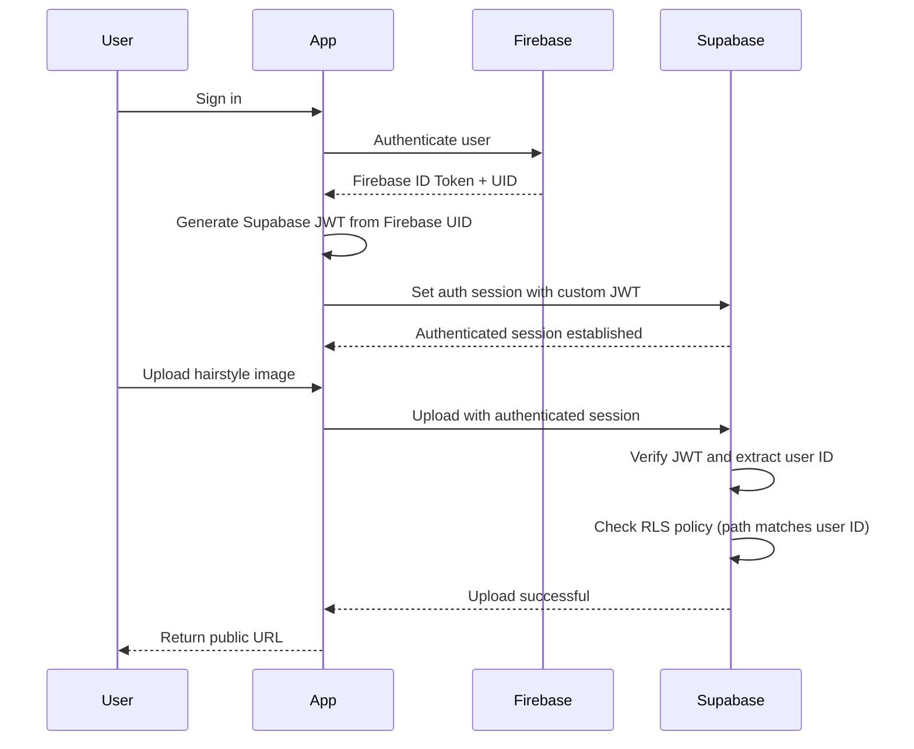
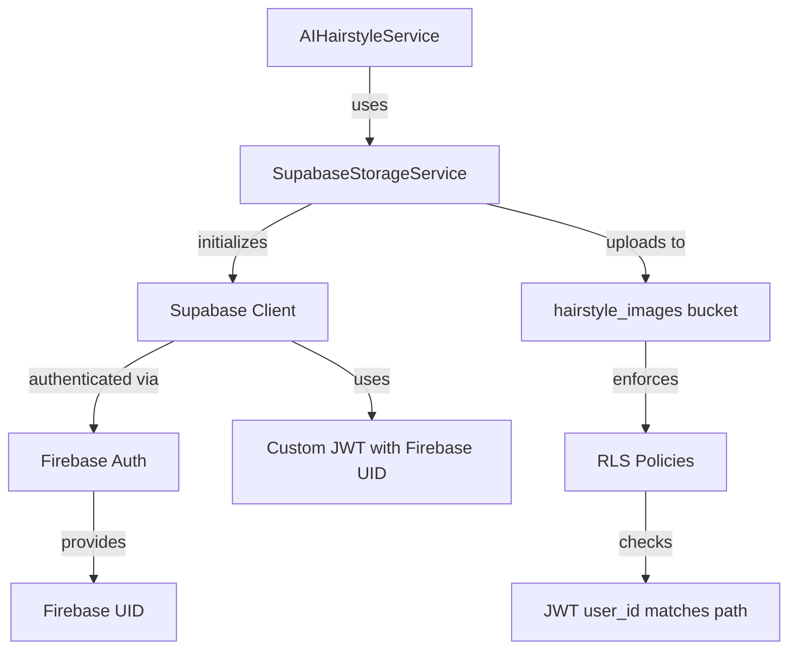

# Design Document: Supabase Storage RLS Fix

## Overview

This design addresses the Row-Level Security (RLS) policy violation preventing authenticated users from uploading hairstyle images to Supabase Storage. The root cause is that the application uses Firebase Authentication for user identity but does not establish an authenticated session with Supabase before attempting storage operations.

The solution involves three main components:

1. **Authentication Bridge**: Generate Supabase JWTs from Firebase ID tokens to authenticate users with Supabase
2. **RLS Policies**: Configure storage-level RLS policies that allow authenticated users to upload files to their own folders
3. **Code Modifications**: Update `SupabaseStorageService` and `AIHairstyleService` to use authenticated Supabase clients

### Key Design Decisions

- **JWT Generation Strategy**: Use Supabase's custom JWT functionality to bridge Firebase Auth with Supabase
- **RLS Policy Approach**: Implement storage-level policies (not table-level) using the `storage.objects` system table
- **Session Management**: Maintain Supabase auth session synchronized with Firebase auth state
- **Error Handling**: Distinguish between authentication failures (401) and authorization failures (403)

## Architecture

### Authentication Flow



### Component Diagram



### Technology Stack

- **Frontend Authentication**: Firebase Authentication (existing)
- **Backend Storage**: Supabase Storage with PostgreSQL RLS
- **JWT Generation**: Supabase custom JWT with Firebase UID as subject claim
- **Client Library**: `supabase_flutter` package (Dart)

## Components and Interfaces

### 1. Firebase Auth to Supabase JWT Bridge

**Purpose**: Convert Firebase authentication credentials into Supabase-compatible JWTs

**Interface**:
```dart
/// Generate a Supabase JWT from Firebase user credentials
/// Returns a JWT string that can be used with Supabase client
Future<String?> generateSupabaseJwt(User firebaseUser) async
```

**Implementation Strategy**:

Since generating a proper JWT requires the Supabase JWT secret (which should never be exposed in client code), we have two approaches:

**Approach A: Supabase Custom Auth (Recommended)**
- Use Supabase's built-in custom auth provider feature
- Configure Supabase to accept Firebase ID tokens directly
- Requires Supabase project configuration

**Approach B: Backend Edge Function**
- Create a Supabase Edge Function that exchanges Firebase ID tokens for Supabase JWTs
- Client sends Firebase ID token to edge function
- Edge function verifies token and generates Supabase JWT using service role
- More complex but provides fine-grained control

**Chosen Approach**: **Approach B (Backend Edge Function)** - This provides better security (JWT secret stays server-side) and more flexibility for validation logic.

**Edge Function Signature**:
```typescript
// Supabase Edge Function: exchange-firebase-token
interface Request {
  firebaseIdToken: string;
}

interface Response {
  supabaseToken: string;
  expiresAt: number;
}
```

**Client Integration**:
```dart
class SupabaseAuthBridge {
  static Future<String?> exchangeFirebaseToken(String firebaseIdToken) async {
    final response = await Supabase.instance.client.functions.invoke(
      'exchange-firebase-token',
      body: {'firebaseIdToken': firebaseIdToken},
    );
    
    if (response.status == 200 && response.data != null) {
      return response.data['supabaseToken'] as String?;
    }
    return null;
  }
  
  static Future<void> syncAuthState(User? firebaseUser) async {
    if (firebaseUser == null) {
      await Supabase.instance.client.auth.signOut();
      return;
    }
    
    final idToken = await firebaseUser.getIdToken();
    if (idToken == null) return;
    
    final supabaseToken = await exchangeFirebaseToken(idToken);
    if (supabaseToken == null) {
      throw Exception('Failed to exchange Firebase token for Supabase token');
    }
    
    await Supabase.instance.client.auth.setSession(supabaseToken);
  }
}
```

### 2. Enhanced SupabaseStorageService

**Changes Required**:

1. **Add Auth Synchronization**
   - Listen to Firebase auth state changes
   - Update Supabase client session when Firebase auth changes
   - Clear Supabase session when user signs out

2. **Initialization Enhancement**
   ```dart
   static Future<Either<Failure, void>> initSupabase({User? firebaseUser}) async {
     // Existing initialization code...
     
     // Set up auth state listener
     FirebaseAuth.instance.authStateChanges().listen((user) async {
       await SupabaseAuthBridge.syncAuthState(user);
     });
     
     // Sync current user if provided
     if (firebaseUser != null) {
       await SupabaseAuthBridge.syncAuthState(firebaseUser);
     }
     
     return const Right(null);
   }
   ```

3. **Upload Method Enhancement**
   - Add pre-flight authentication check
   - Enhanced error logging for RLS violations

   ```dart
   static Future<Either<Failure, String>> uploadImage({
     required File file,
     required String bucket,
     required String path,
   }) async {
     // Verify authentication
     final session = Supabase.instance.client.auth.currentSession;
     if (session == null) {
       log('Upload attempted without authenticated session', 
           name: 'SupabaseStorageService');
       return const Left(
         AuthenticationFailure('User must be authenticated to upload files'),
       );
     }
     
     // Existing upload logic with enhanced error handling
     try {
       // ... existing upload code ...
     } on StorageException catch (e, stackTrace) {
       // Enhanced RLS error detection
       if (e.statusCode == '403' || e.message.contains('row-level security')) {
         log('RLS policy violation: ${e.message}', name: 'SupabaseStorageService');
         return Left(
           AuthorizationFailure(
             'Permission denied: Unable to upload to the specified path. '
             'Ensure the path matches your user ID.',
             stackTrace,
           ),
         );
       }
       // ... other error handling ...
     }
   }
   ```

### 3. RLS Policy Configuration

**Storage RLS Policies**:

Supabase Storage uses PostgreSQL's RLS on the `storage.objects` table. Policies must be created to:

1. Allow authenticated users to INSERT objects into their own folder
2. Allow authenticated users to SELECT objects from their own folder
3. Allow authenticated users to UPDATE/DELETE objects in their own folder
4. Allow public READ access to all objects (since bucket is public)

**Path Validation Logic**:
- Upload path format: `{userId}/{timestamp}_hairstyle.jpg`
- RLS policy must extract the first path segment and compare with `auth.uid()`

### 4. Edge Function for Token Exchange

**Function Structure**:
```typescript
// supabase/functions/exchange-firebase-token/index.ts
import { serve } from 'https://deno.land/std@0.168.0/http/server.ts'
import { createClient } from 'https://esm.sh/@supabase/supabase-js@2'

serve(async (req) => {
  try {
    const { firebaseIdToken } = await req.json()
    
    // Verify Firebase ID token
    const firebaseUser = await verifyFirebaseToken(firebaseIdToken)
    
    if (!firebaseUser) {
      return new Response(
        JSON.stringify({ error: 'Invalid Firebase token' }),
        { status: 401, headers: { 'Content-Type': 'application/json' } }
      )
    }
    
    // Create Supabase admin client
    const supabaseAdmin = createClient(
      Deno.env.get('SUPABASE_URL') ?? '',
      Deno.env.get('SUPABASE_SERVICE_ROLE_KEY') ?? ''
    )
    
    // Generate custom JWT for Supabase
    const { data, error } = await supabaseAdmin.auth.admin.generateLink({
      type: 'magiclink',
      email: firebaseUser.email,
      options: {
        data: {
          firebase_uid: firebaseUser.uid,
          provider: 'firebase'
        }
      }
    })
    
    if (error) throw error
    
    return new Response(
      JSON.stringify({
        supabaseToken: data.properties.hashed_token,
        expiresAt: data.properties.expires_at
      }),
      { status: 200, headers: { 'Content-Type': 'application/json' } }
    )
  } catch (error) {
    return new Response(
      JSON.stringify({ error: error.message }),
      { status: 500, headers: { 'Content-Type': 'application/json' } }
    )
  }
})

async function verifyFirebaseToken(idToken: string) {
  // Use Firebase Admin SDK to verify token
  // This requires setting up Firebase Admin in the edge function
  // Alternative: Use Firebase REST API for token verification
  const response = await fetch(
    `https://identitytoolkit.googleapis.com/v1/accounts:lookup?key=${Deno.env.get('FIREBASE_API_KEY')}`,
    {
      method: 'POST',
      headers: { 'Content-Type': 'application/json' },
      body: JSON.stringify({ idToken })
    }
  )
  
  if (!response.ok) return null
  
  const data = await response.json()
  return data.users?.[0]
}
```

## Data Models

### Supabase JWT Claims

The custom Supabase JWT will contain the following claims:

```json
{
  "sub": "firebase_uid_here",
  "aud": "authenticated",
  "role": "authenticated",
  "email": "user@example.com",
  "app_metadata": {
    "provider": "firebase",
    "firebase_uid": "firebase_uid_here"
  },
  "user_metadata": {
    "firebase_uid": "firebase_uid_here"
  },
  "exp": 1234567890,
  "iat": 1234567890
}
```

**Key Fields**:
- `sub`: Subject claim set to Firebase UID (used in RLS policies as `auth.uid()`)
- `role`: Must be "authenticated" for RLS policies to recognize the user
- `app_metadata.firebase_uid`: Additional reference to Firebase UID for debugging

### Storage Object Path Structure

**Pattern**: `{bucket_name}/{user_id}/{timestamp}_{file_type}.{extension}`

**Example**: `hairstyle_images/abc123xyz/1705423891234_hairstyle.jpg`

**Components**:
- `bucket_name`: `hairstyle_images`
- `user_id`: Firebase UID (e.g., `abc123xyz`)
- `timestamp`: Unix timestamp in milliseconds
- `file_type`: Descriptive name (e.g., `hairstyle`)
- `extension`: Image format (e.g., `jpg`, `png`)

## Error Handling

### Error Categories

1. **Authentication Errors (401)**
   - No Firebase user signed in
   - Supabase JWT missing or expired
   - Invalid JWT signature
   
   **User Message**: "Please sign in to upload images"

2. **Authorization Errors (403)**
   - Valid JWT but RLS policy denies access
   - User attempting to upload to another user's folder
   - Bucket RLS not properly configured
   
   **User Message**: "Permission denied. You can only upload to your own folder"

3. **Network Errors**
   - Connection timeout
   - No internet connectivity
   
   **User Message**: "Network error. Please check your connection and try again"

4. **Validation Errors**
   - File doesn't exist
   - Invalid file format
   - File size exceeds limit
   
   **User Message**: "Invalid file. Please select a valid image"

### Error Handling Flow

```dart
// In SupabaseStorageService.uploadImage
try {
  // ... upload logic ...
} on SocketException catch (e, stackTrace) {
  log('Network error: $e', name: 'SupabaseStorageService');
  return Left(NetworkFailure('Please check your internet connection', stackTrace));
} on StorageException catch (e, stackTrace) {
  log('Storage error: ${e.statusCode} - ${e.message}', name: 'SupabaseStorageService');
  
  // Distinguish between auth errors and RLS errors
  if (e.statusCode == '401') {
    return Left(AuthenticationFailure('Please sign in to upload images', stackTrace));
  } else if (e.statusCode == '403' || e.message.contains('row-level security')) {
    return Left(AuthorizationFailure(
      'Permission denied: You can only upload to your own folder', 
      stackTrace
    ));
  }
  
  return Left(SupabaseFailure('Upload failed: ${e.message}', stackTrace));
} catch (e, stackTrace) {
  log('Unexpected error: $e', name: 'SupabaseStorageService');
  return Left(UnknownFailure('An unexpected error occurred', stackTrace));
}
```

### New Failure Classes

```dart
// Add to core/errors/failures.dart

class AuthenticationFailure extends Failure {
  const AuthenticationFailure(String message, [StackTrace? stackTrace])
      : super(message, stackTrace);
}

class AuthorizationFailure extends Failure {
  const AuthorizationFailure(String message, [StackTrace? stackTrace])
      : super(message, stackTrace);
}
```

## SQL Migration Scripts

### Migration 001: Enable RLS on hairstyle_images bucket

```sql
-- Migration: 001_enable_rls_hairstyle_images.sql
-- Description: Enable Row-Level Security for hairstyle_images bucket
-- Date: 2025-01-16

-- Enable RLS on storage.objects table (if not already enabled)
ALTER TABLE storage.objects ENABLE ROW LEVEL SECURITY;

-- Drop existing policies if they exist (for idempotency)
DROP POLICY IF EXISTS "Users can insert their own hairstyle images" ON storage.objects;
DROP POLICY IF EXISTS "Users can select their own hairstyle images" ON storage.objects;
DROP POLICY IF EXISTS "Users can update their own hairstyle images" ON storage.objects;
DROP POLICY IF EXISTS "Users can delete their own hairstyle images" ON storage.objects;
DROP POLICY IF EXISTS "Public can read hairstyle images" ON storage.objects;

-- Policy 1: Allow authenticated users to INSERT into their own folder
CREATE POLICY "Users can insert their own hairstyle images"
ON storage.objects
FOR INSERT
TO authenticated
WITH CHECK (
  bucket_id = 'hairstyle_images' AND
  (storage.foldername(name))[1] = auth.uid()::text
);

-- Policy 2: Allow authenticated users to SELECT from their own folder
CREATE POLICY "Users can select their own hairstyle images"
ON storage.objects
FOR SELECT
TO authenticated
USING (
  bucket_id = 'hairstyle_images' AND
  (storage.foldername(name))[1] = auth.uid()::text
);

-- Policy 3: Allow authenticated users to UPDATE their own images
CREATE POLICY "Users can update their own hairstyle images"
ON storage.objects
FOR UPDATE
TO authenticated
USING (
  bucket_id = 'hairstyle_images' AND
  (storage.foldername(name))[1] = auth.uid()::text
)
WITH CHECK (
  bucket_id = 'hairstyle_images' AND
  (storage.foldername(name))[1] = auth.uid()::text
);

-- Policy 4: Allow authenticated users to DELETE their own images
CREATE POLICY "Users can delete their own hairstyle images"
ON storage.objects
FOR DELETE
TO authenticated
USING (
  bucket_id = 'hairstyle_images' AND
  (storage.foldername(name))[1] = auth.uid()::text
);

-- Policy 5: Allow public read access to all hairstyle images
-- (Since the bucket is public, anyone should be able to view uploaded images)
CREATE POLICY "Public can read hairstyle images"
ON storage.objects
FOR SELECT
TO public
USING (
  bucket_id = 'hairstyle_images'
);

-- Verify policies were created
SELECT schemaname, tablename, policyname, permissive, roles, cmd, qual
FROM pg_policies
WHERE tablename = 'objects' AND schemaname = 'storage'
  AND policyname LIKE '%hairstyle%';
```

### Policy Explanation

**Path Extraction**: `(storage.foldername(name))[1]`
- `storage.foldername(name)` returns an array of folder segments from the path
- `[1]` gets the first segment (the user ID)
- Example: For path `abc123/1705423891234_hairstyle.jpg`, returns `abc123`

**User ID Comparison**: `auth.uid()::text`
- `auth.uid()` returns the authenticated user's ID from the JWT `sub` claim
- Cast to text for comparison with the path segment

**Bucket Filtering**: `bucket_id = 'hairstyle_images'`
- Ensures policies only apply to the hairstyle_images bucket
- Other buckets remain unaffected

### Alternative: Supabase Dashboard Configuration

For users who prefer GUI configuration:

1. Navigate to **Storage** → **Policies** in Supabase Dashboard
2. Select the `hairstyle_images` bucket
3. Click **New Policy**
4. For INSERT policy:
   - **Policy name**: `Users can insert their own hairstyle images`
   - **Allowed operation**: INSERT
   - **Target roles**: authenticated
   - **Policy definition (WITH CHECK)**:
     ```sql
     bucket_id = 'hairstyle_images' AND (storage.foldername(name))[1] = auth.uid()::text
     ```
5. Repeat for SELECT, UPDATE, DELETE policies with similar configuration
6. For public read policy:
   - **Target roles**: public
   - **Allowed operation**: SELECT
   - **Policy definition (USING)**:
     ```sql
     bucket_id = 'hairstyle_images'
     ```

## Code Modifications

### 1. Create SupabaseAuthBridge Class

**File**: `lib/core/services/supabase_auth_bridge.dart`

```dart
import 'dart:developer';
import 'package:firebase_auth/firebase_auth.dart';
import 'package:supabase_flutter/supabase_flutter.dart';

/// Bridge between Firebase Authentication and Supabase
/// Synchronizes auth state and exchanges tokens
class SupabaseAuthBridge {
  /// Exchange Firebase ID token for Supabase JWT
  static Future<String?> exchangeFirebaseToken(String firebaseIdToken) async {
    try {
      log('Exchanging Firebase token for Supabase JWT', name: 'SupabaseAuthBridge');
      
      final response = await Supabase.instance.client.functions.invoke(
        'exchange-firebase-token',
        body: {'firebaseIdToken': firebaseIdToken},
      );
      
      if (response.status == 200 && response.data != null) {
        final token = response.data['supabaseToken'] as String?;
        log('Successfully exchanged token', name: 'SupabaseAuthBridge');
        return token;
      }
      
      log('Token exchange failed: ${response.status}', name: 'SupabaseAuthBridge');
      return null;
    } catch (e, stackTrace) {
      log('Error exchanging token: $e', name: 'SupabaseAuthBridge', stackTrace: stackTrace);
      return null;
    }
  }
  
  /// Synchronize Supabase auth state with Firebase auth state
  static Future<void> syncAuthState(User? firebaseUser) async {
    try {
      if (firebaseUser == null) {
        log('Firebase user signed out, clearing Supabase session', name: 'SupabaseAuthBridge');
        await Supabase.instance.client.auth.signOut();
        return;
      }
      
      log('Firebase user signed in: ${firebaseUser.uid}', name: 'SupabaseAuthBridge');
      
      final idToken = await firebaseUser.getIdToken();
      if (idToken == null) {
        log('Failed to get Firebase ID token', name: 'SupabaseAuthBridge');
        return;
      }
      
      final supabaseToken = await exchangeFirebaseToken(idToken);
      if (supabaseToken == null) {
        throw Exception('Failed to exchange Firebase token for Supabase token');
      }
      
      await Supabase.instance.client.auth.setSession(supabaseToken);
      log('Supabase session established for user: ${firebaseUser.uid}', name: 'SupabaseAuthBridge');
    } catch (e, stackTrace) {
      log('Error syncing auth state: $e', name: 'SupabaseAuthBridge', stackTrace: stackTrace);
      rethrow;
    }
  }
}
```

### 2. Modify SupabaseStorageService

**Changes to `lib/core/services/supabase_storage_service.dart`**:

**A. Update initialization to sync auth**

```dart
// Add import
import 'package:firebase_auth/firebase_auth.dart';
import 'supabase_auth_bridge.dart';

// Add to class
static StreamSubscription<User?>? _authSubscription;

// Modify initSupabase method
static Future<Either<Failure, void>> initSupabase() async {
  if (_isInitialized) {
    return const Right(null);
  }

  // ... existing validation and initialization ...

  try {
    // ... existing Supabase initialization ...

    _isInitialized = true;
    
    // Set up Firebase auth listener
    _authSubscription = FirebaseAuth.instance.authStateChanges().listen((user) async {
      try {
        await SupabaseAuthBridge.syncAuthState(user);
      } catch (e) {
        log('Error in auth state listener: $e', name: 'SupabaseStorageService');
      }
    });
    
    // Sync current user if already signed in
    final currentUser = FirebaseAuth.instance.currentUser;
    if (currentUser != null) {
      await SupabaseAuthBridge.syncAuthState(currentUser);
    }

    // ... existing bucket initialization ...

    return const Right(null);
  } catch (e, stackTrace) {
    // ... existing error handling ...
  }
}

// Add cleanup method
static Future<void> dispose() async {
  await _authSubscription?.cancel();
  _authSubscription = null;
}
```

**B. Add authentication check to uploadImage**

```dart
static Future<Either<Failure, String>> uploadImage({
  required File file,
  required String bucket,
  required String path,
}) async {
  final initResult = await _ensureInitialized();
  if (initResult.isLeft()) {
    return initResult.fold(
      (failure) => Left(failure),
      (_) => const Left(UnknownFailure('Unexpected error during initialization')),
    );
  }

  // Check authentication
  final session = _supabase.client.auth.currentSession;
  final userId = session?.user?.id;
  
  if (session == null || userId == null) {
    log('Upload attempted without authenticated session', name: 'SupabaseStorageService');
    return const Left(
      AuthenticationFailure('User must be authenticated to upload files'),
    );
  }
  
  log('Uploading as authenticated user: $userId', name: 'SupabaseStorageService');

  try {
    // ... existing file existence check ...

    log('Uploading image to $bucket: $path', name: 'SupabaseStorageService');

    final bytes = await file.readAsBytes();
    final String extension = path_helper.extension(file.path);

    await _supabase.client.storage.from(bucket).uploadBinary(
      path,
      bytes,
      fileOptions: FileOptions(
        contentType: _getContentType(extension),
        upsert: true,
      ),
    );

    final String publicUrl = _supabase.client.storage.from(bucket).getPublicUrl(path);

    log('Successfully uploaded image: $publicUrl', name: 'SupabaseStorageService');
    return Right(publicUrl);
  } on SocketException catch (e, stackTrace) {
    // ... existing network error handling ...
  } on StorageException catch (e, stackTrace) {
    log('Storage error uploading image: ${e.statusCode} - ${e.message}', 
        name: 'SupabaseStorageService');
    
    // Enhanced error detection
    if (e.statusCode == '401') {
      return Left(
        AuthenticationFailure('Authentication required to upload files', stackTrace),
      );
    } else if (e.statusCode == '403' || e.message.toLowerCase().contains('row-level security')) {
      log('RLS policy violation. User: $userId, Path: $path', name: 'SupabaseStorageService');
      return Left(
        AuthorizationFailure(
          'Permission denied: You can only upload to your own folder',
          stackTrace,
        ),
      );
    }
    
    return Left(SupabaseFailure('Storage error: ${e.message}', stackTrace));
  } catch (e, stackTrace) {
    // ... existing general error handling ...
  }
}
```

### 3. Update Failure Classes

**File**: `lib/core/errors/failures.dart`

Add new failure types:

```dart
/// Authentication failure - user not signed in or session expired
class AuthenticationFailure extends Failure {
  const AuthenticationFailure(String message, [StackTrace? stackTrace])
      : super(message, stackTrace);
}

/// Authorization failure - user lacks permission for the requested action
class AuthorizationFailure extends Failure {
  const AuthorizationFailure(String message, [StackTrace? stackTrace])
      : super(message, stackTrace);
}
```

### 4. Enhance AIHairstyleService Error Handling

**File**: `lib/features/ai_flow/data/ai_hairstyle_service.dart`

```dart
Future<String> _uploadSourcePhoto(String photoPath) async {
  final user = FirebaseAuth.instance.currentUser;
  if (user == null) {
    throw Exception('User must be authenticated to upload photos');
  }

  developer.log('Uploading hairstyle image for user: ${user.uid}', 
                name: 'AIHairstyleService');

  final result = await SupabaseStorageService.uploadHairstyleImage(
    file: File(photoPath),
    userId: user.uid,
  );

  return result.fold(
    (failure) {
      developer.log('Upload failed: ${failure.message}', name: 'AIHairstyleService');
      
      // Provide user-friendly error messages
      if (failure is AuthenticationFailure) {
        throw Exception('Please sign in to upload photos');
      } else if (failure is AuthorizationFailure) {
        throw Exception('Permission denied. Please try signing in again');
      } else if (failure is NetworkFailure) {
        throw Exception('Network error. Please check your connection');
      } else {
        throw Exception('Upload failed: ${failure.message}');
      }
    },
    (url) {
      developer.log('Upload successful: $url', name: 'AIHairstyleService');
      return url;
    },
  );
}
```

## Testing Strategy

### Unit Tests

**Test Coverage**:

1. **SupabaseAuthBridge Tests**
   - Test token exchange with valid Firebase token
   - Test token exchange with invalid Firebase token
   - Test auth state sync when user signs in
   - Test auth state sync when user signs out
   - Test error handling when edge function is unavailable

2. **SupabaseStorageService Tests**
   - Test upload with authenticated user succeeds
   - Test upload without authentication returns AuthenticationFailure
   - Test upload to another user's folder returns AuthorizationFailure
   - Test error distinction between 401 and 403
   - Test auth state listener registration
   - Test cleanup/dispose method

3. **AIHairstyleService Tests**
   - Test upload flow with authenticated user
   - Test upload flow with unauthenticated user throws exception
   - Test error message mapping from failures to user-friendly messages

4. **Failure Classes Tests**
   - Test AuthenticationFailure creation and message
   - Test AuthorizationFailure creation and message

### Integration Tests

**Test Scenarios**:

1. **End-to-End Upload Flow**
   ```dart
   testWidgets('Authenticated user can upload hairstyle image', (tester) async {
     // Arrange: Sign in with Firebase
     final firebaseAuth = FirebaseAuth.instance;
     await firebaseAuth.signInWithEmailAndPassword(
       email: 'test@example.com',
       password: 'testpass123',
     );
     
     // Act: Upload image
     final result = await SupabaseStorageService.uploadHairstyleImage(
       file: File('test_assets/sample_hairstyle.jpg'),
       userId: firebaseAuth.currentUser!.uid,
     );
     
     // Assert: Upload successful and URL is returned
     expect(result.isRight(), true);
     result.fold(
       (failure) => fail('Upload should succeed'),
       (url) => expect(url, contains('hairstyle_images')),
     );
   });
   ```

2. **Unauthenticated Upload Rejection**
   ```dart
   testWidgets('Unauthenticated user cannot upload', (tester) async {
     // Arrange: Sign out
     await FirebaseAuth.instance.signOut();
     
     // Act: Attempt upload
     final result = await SupabaseStorageService.uploadHairstyleImage(
       file: File('test_assets/sample_hairstyle.jpg'),
       userId: 'fake_user_id',
     );
     
     // Assert: Returns AuthenticationFailure
     expect(result.isLeft(), true);
     result.fold(
       (failure) => expect(failure, isA<AuthenticationFailure>()),
       (url) => fail('Upload should fail without authentication'),
     );
   });
   ```

3. **Cross-User Upload Prevention**
   ```dart
   testWidgets('User cannot upload to another user folder', (tester) async {
     // Arrange: Sign in as user A
     await FirebaseAuth.instance.signInWithEmailAndPassword(
       email: 'userA@example.com',
       password: 'testpass123',
     );
     
     // Act: Attempt to upload to user B's folder
     final result = await SupabaseStorageService.uploadImage(
       file: File('test_assets/sample_hairstyle.jpg'),
       bucket: 'hairstyle_images',
       path: 'userB_id/1234_hairstyle.jpg',
     );
     
     // Assert: Returns AuthorizationFailure
     expect(result.isLeft(), true);
     result.fold(
       (failure) => expect(failure, isA<AuthorizationFailure>()),
       (url) => fail('Cross-user upload should be denied by RLS'),
     );
   });
   ```

4. **Auth State Synchronization**
   ```dart
   test('Supabase session syncs with Firebase sign in', () async {
     // Arrange: Start with no session
     expect(Supabase.instance.client.auth.currentSession, isNull);
     
     // Act: Sign in with Firebase
     await FirebaseAuth.instance.signInWithEmailAndPassword(
       email: 'test@example.com',
       password: 'testpass123',
     );
     
     // Wait for auth state listener to process
     await Future.delayed(const Duration(milliseconds: 500));
     
     // Assert: Supabase session is established
     final session = Supabase.instance.client.auth.currentSession;
     expect(session, isNotNull);
     expect(session?.user?.id, equals(FirebaseAuth.instance.currentUser?.uid));
   });
   ```

5. **Edge Function Token Exchange**
   ```dart
   test('Edge function exchanges Firebase token successfully', () async {
     // Arrange: Get Firebase ID token
     final user = FirebaseAuth.instance.currentUser;
     final idToken = await user?.getIdToken();
     expect(idToken, isNotNull);
     
     // Act: Exchange token
     final supabaseToken = await SupabaseAuthBridge.exchangeFirebaseToken(idToken!);
     
     // Assert: Supabase token is returned
     expect(supabaseToken, isNotNull);
     expect(supabaseToken, isA<String>());
     expect(supabaseToken!.length, greaterThan(0));
   });
   ```

### Manual Testing Checklist

1. **Pre-deployment Verification**
   - [ ] RLS policies created in Supabase dashboard
   - [ ] Edge function deployed and accessible
   - [ ] Firebase API key configured in edge function environment
   - [ ] Supabase service role key configured in edge function

2. **Authentication Flow Testing**
   - [ ] Sign in with Firebase and verify Supabase session created
   - [ ] Sign out from Firebase and verify Supabase session cleared
   - [ ] App restart with existing Firebase session restores Supabase session

3. **Upload Testing**
   - [ ] Upload hairstyle image as authenticated user succeeds
   - [ ] Upload returns valid public URL
   - [ ] Image is accessible at the returned URL
   - [ ] Attempting upload while signed out shows authentication error

4. **RLS Policy Testing**
   - [ ] User A can upload to their own folder (userId_A/*)
   - [ ] User A cannot upload to User B's folder (userId_B/*)
   - [ ] Attempting cross-user upload shows authorization error
   - [ ] Public users can view uploaded images (GET requests)

5. **Error Message Testing**
   - [ ] Authentication errors show user-friendly message
   - [ ] Authorization errors show user-friendly message
   - [ ] Network errors show user-friendly message
   - [ ] Log messages contain sufficient debugging information

### Test Environment Setup

**Requirements**:
- Firebase project with test user accounts
- Supabase project with RLS policies applied
- Edge function deployed to Supabase
- Test image files in `test_assets/` directory

**Configuration**:
```dart
// test/test_config.dart
class TestConfig {
  static const String testUserEmail = 'test@example.com';
  static const String testUserPassword = 'testpass123';
  static const String testUserId = 'test_user_id_123';
  
  static const String otherUserEmail = 'other@example.com';
  static const String otherUserId = 'other_user_id_456';
  
  static const String testImagePath = 'test_assets/sample_hairstyle.jpg';
}
```

## Deployment Steps

1. **Deploy Edge Function**
   ```bash
   cd supabase/functions
   supabase functions deploy exchange-firebase-token
   ```

2. **Configure Edge Function Environment Variables**
   ```bash
   supabase secrets set FIREBASE_API_KEY=your_firebase_api_key
   ```

3. **Apply RLS Policies**
   - Option A: Run SQL migration via Supabase SQL Editor
   - Option B: Apply policies manually through Supabase Dashboard

4. **Verify Bucket Configuration**
   - Ensure `hairstyle_images` bucket exists
   - Verify bucket is set to public (for reading uploaded images)
   - Confirm RLS is enabled on the bucket

5. **Deploy Code Changes**
   - Update Flutter app with new code
   - Test authentication flow in staging environment
   - Test upload flow with authenticated user
   - Verify error handling for unauthenticated users

6. **Monitor and Validate**
   - Check Supabase logs for RLS policy hits
   - Monitor edge function invocations
   - Verify Firebase-Supabase token exchanges
   - Check for any 403 errors in production

## Security Considerations

### JWT Security

- **Service Role Key**: Never expose Supabase service role key in client code
- **Token Expiration**: Supabase JWTs should have reasonable expiration times (1 hour recommended)
- **Token Refresh**: Implement token refresh logic before expiration
- **Token Storage**: Do not store tokens in insecure locations (localStorage should be avoided for long-term storage)

### RLS Policy Security

- **Path Validation**: Always validate that user can only access their own folder
- **SQL Injection**: RLS policies use parameterized queries internally, no additional sanitization needed
- **Policy Testing**: Test policies with multiple user accounts to ensure isolation

### Firebase Token Verification

- **Edge Function Validation**: Always verify Firebase tokens in the edge function before generating Supabase JWT
- **Token Replay Prevention**: Consider adding nonce or timestamp validation
- **Rate Limiting**: Implement rate limiting on token exchange endpoint to prevent abuse

### Bucket Security

- **Public Access**: Only allow public READ access, not WRITE
- **Bucket Isolation**: Ensure RLS policies are specific to `hairstyle_images` bucket only
- **File Type Validation**: Consider adding file type validation in edge function or storage triggers

## Performance Considerations

### Token Caching

- Cache Supabase JWT until it expires to avoid unnecessary edge function calls
- Implement token refresh logic 5 minutes before expiration
- Use in-memory cache, not persistent storage

### Network Optimization

- Reuse Supabase client instance across requests
- Implement connection pooling in edge function
- Consider using Supabase's CDN for faster image delivery

### Monitoring

- Track token exchange latency
- Monitor RLS policy execution time
- Set up alerts for failed authentication attempts

## Known Limitations

1. **Token Exchange Latency**: Initial upload requires token exchange, adding ~200-500ms latency
2. **Offline Support**: Auth state sync requires network connectivity
3. **Token Expiration**: Users with expired sessions must re-authenticate
4. **Edge Function Cold Start**: First invocation may have higher latency (~1-2s)

## Future Enhancements

1. **Token Refresh**: Implement automatic token refresh before expiration
2. **Offline Queue**: Queue uploads when offline and retry when connected
3. **Progress Tracking**: Add upload progress callbacks for large files
4. **Image Optimization**: Compress images before upload
5. **Retry Logic**: Implement exponential backoff for failed uploads
